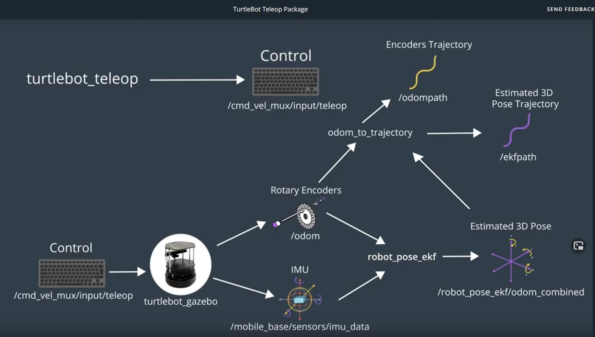
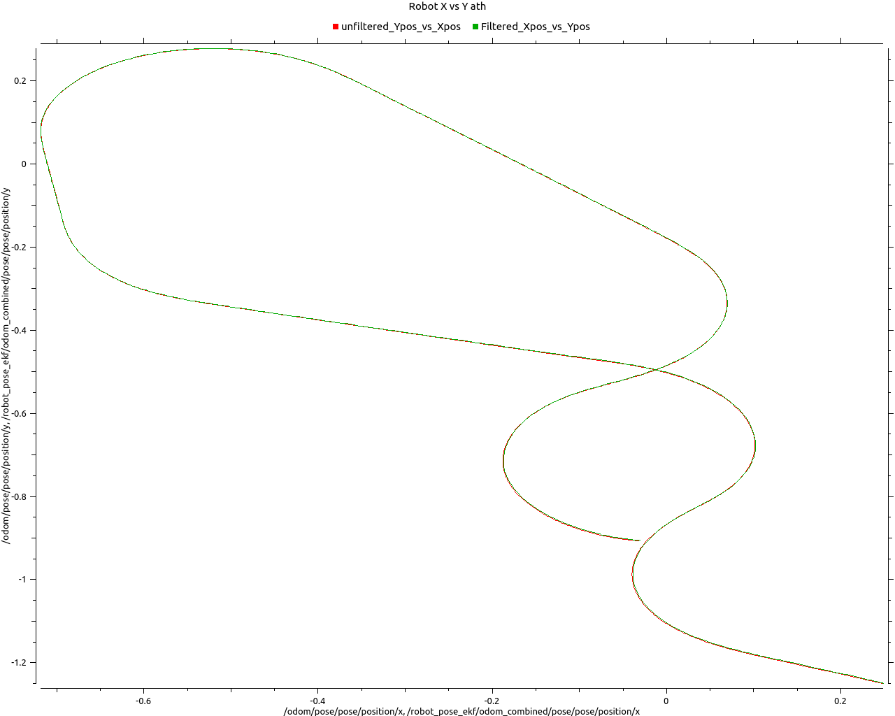

# UDACITY TURTLE KALMAN LAB
 

### SOURCE CODE
 - https://github.com/udacity/RoboND-EKFLab 

### TURTBLE BOT SETUP
 - PKG DOC
   - Turtlebot package - http://wiki.ros.org/turtlebot_gazebo 
   - EKF package - http://wiki.ros.org/robot_pose_ekf
   - turtlebot_teleop documentation - http://wiki.ros.org/turtlebot_teleop

  - SRC
    - cd /home/workspace/catkin_ws/src
    - **BOT** git clone https://github.com/turtlebot/turtlebot_simulator
    - **EKF** git clone https://github.com/udacity/robot_pose_ekf 
    - **TRAJ** git clone https://github.com/udacity/odom_to_trajectory
    - **TELE** git clone https://github.com/turtlebot/turtlebot

  - DEP 
    - cd /home/workspace/catkin_ws/
    - source devel/setup.bash
    - **BOT** rosdep -i install turtlebot_gazebo
    - **TELE**  rosdep -i install turtlebot_teleop

 - BUILD
    - catkin_make

 - LAUNCH
    - source devel/setup.bash
    - roslaunch turtlebot_gazebo turtlebot_world.launch
    - roslaunch robot_pose_ekf robot_pose_ekf.launch
    - roslaunch odom_to_trajectory create_trajectory.launch 
    - roslaunch turtlebot_teleop keyboard_teleop.launch
    - save 
      - rosrun rvis rvis -d ./src/EKFLab.viz

 - TODO:
   - List: rostopic list
   - Visualize the topics: rosrun rqt_graph rqt_graph
   - rqt_image_view \camera\rgb\raw_image
   - rosrun rviz rviz
     - Change the Fixed Frame to base_footprint
     - Change the Reference Frame to odom
     - Add a RobotModel
     - Add a camera and select the /camera/rgb/image_raw topic
     - Add a /ekfpath topic and change the display name to EKFPath
     - Add a /odompath topic and change the display name to OdomPath
     - Change the OdomPath color to red:255;0;0

## main package
 - Create a main package:
   - catkin_create_pkg main
   - catkin_make

- Create and edit the main.launch file:
   - cd /home/workspace/catkin_ws/src/main
   - mkdir launch
   - cd launch 
   - gedit main.launch
   - cp https://github.com/udacity/RoboND-EKFLab/blob/master/main/launch/main.launch 

- Copy the main.launch file from GitHub
   - source devel/setup.bash
   - roslaunch main main.launch

# rqt_multiplot 
PLOTTING X/Y positions of Filtered estimate vs sensor
 -  ROS plugin doc https://github.com/ethz-asl/rqt_multiplot_plugin

## Install
```
 apt-get install ros-kinetic-rqt -y
 apt-get install ros-kinetic-rqt-multiplot -y
 apt-get install libqwt-dev -y
 rm -rf ~/.config/ros.org/rqt_gui.ini
```

## Sample plot from driving robot
 

