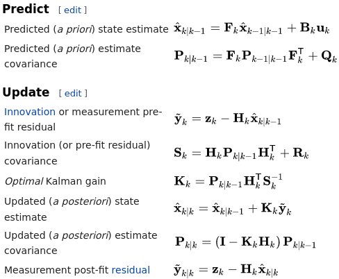

## LOCALIZATION - 

MultivariateGaussian   

## [KALAMAN](https://en.wikipedia.org/wiki/Kalman_filter)
Kalman filters are based on linear dynamical systems discretized in the time domain. In statistics and control theory, Kalman filtering, also known as *linear quadratic estimation* **(LQE)**, is an algorithm that uses a series of measurements observed over time, containing statistical noise and other inaccuracies, and produces estimates of unknown variables that tend to be more accurate than those based on a single measurement alone, by estimating a joint probability distribution over the variables for each timeframe.

## System Model
At time k an observation (or measurement) zk of the true state xk 

- **x_post = F\*x_prio + B\*u + w** - state transition eq
- **z = H\*x + v** - @time  an observation/measurement z of the true state x

### Model Parmeters
In order to use the Kalman filter to estimate the internal state of a process given only a sequence of noisy observations one must model the process in accordance with the following framework. This means specifying the following matrices:

- **F** state-transition model - *maps state to next time increment*
- **B** control-input model - *maps control-input into state space*
- **u** control-input vector
- **H** observation model -* maps the true state space into the observed space*
- **Q** covariance of the process noise
    - **w** is process noise, w ∼ N ( 0 , Q )  (see v for details)
- **R** covariance of the observation noise
    - **v** is observation noise (white, zero mean, multivar, norm/Gaussian) w/ covariance R 
    - multivar sample from, v ∼ N ( 0 , R ) 
    - The initial state, and the noise vectors at each step {x0, w1, ..., wk, v1, ... ,vk} are all assumed to be mutually independent.  
 
### Kalman State Variables
- **x_post** The a posteriori state estimate at time k given observations up to and including at time k;
- **P_post**  the a posteriori estimate covariance matrix (a measure of the estimated accuracy of the state estimate).

### Kalman Predicts
- **x_prio** Predicted (a priori) state estimate
- **P_prio** Predicted (a priori) estimate covariance 

### Kalman Update
- **y = z - H\*x** Innovation or measurement pre-fit residual 
- **S = H\*P_post\*H_trasp + R** Innovation (or pre-fit residual) covariance 
- **K = P_post\*H_trasp/S** Optimal Kalman gain 
- **x_post = x_prio + K\*y** Updated (a posteriori) state estimate 
- **P_post = (I-K\*H)\*P_prio** Updated (a posteriori) estimate covariance 
- **y = z - H\*x_post** Measurement post-fit residual
- **P = F * P * F * T_trasp + Q** Predicted (a priori) estimate covariance 	

## Kalman EQ
 

## Kalman - Intuitive Way
to express the Updated state estimate ( Xe k ∣ k ) is:

- ***x_post = (1-K\*H)/*x_prio +K(\*H\*x + v)**

This expression reminds us of a linear interpolation, x = ( 1 − K) ( a ) + K ( b )  
    - **K** is the Kalman gain K matrix, 
      - Lower: 0 (high error in the sensor) 
      - Upper: I/identiy (low error).
    - **a**  value estimated from the model
    - **b**  value from the measuremen

# Docker Notes
- sudo docker container ls -a
    - lists all containers & history(-a)
 sudo docker container run --publish 80:80 nginx
  - Ports port localhost:80 to port 80
  - (-p) short cut
- sudo docker container run --publish 80:80 --name webhost --detach --rm nginx
   - name and run detached
   - (-rm) remove shortcut
   - (-d) deteched
- sudo docker container stop webhost
- Data presistance (-v)
- sudo docker container run --rm --name mongo -p 27001:27017 -d mongo:4.2.11
   - docker container creates mongo database
- sudo docker exec -it mongo bash
   - create bash shell w/ mongo

