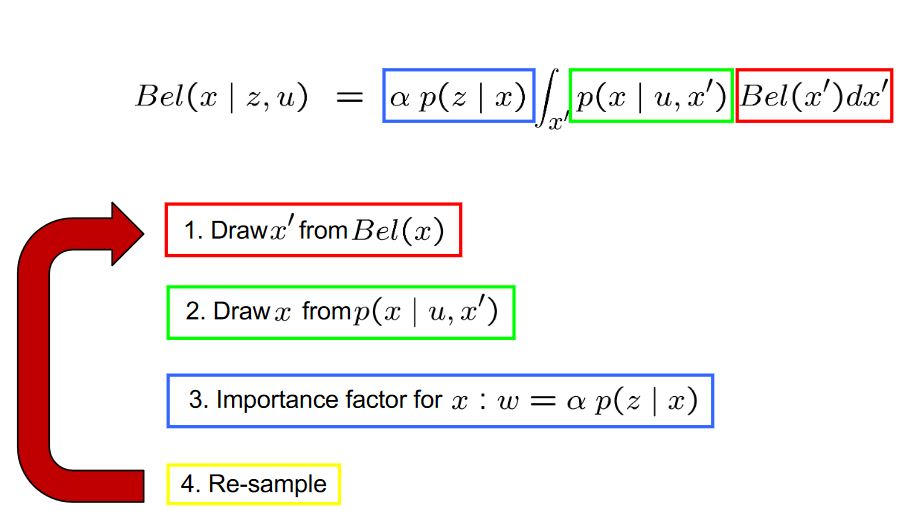
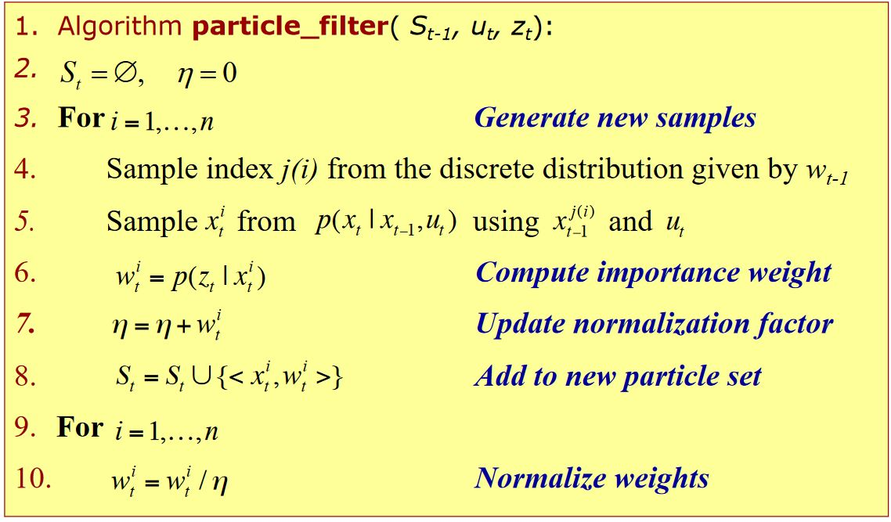
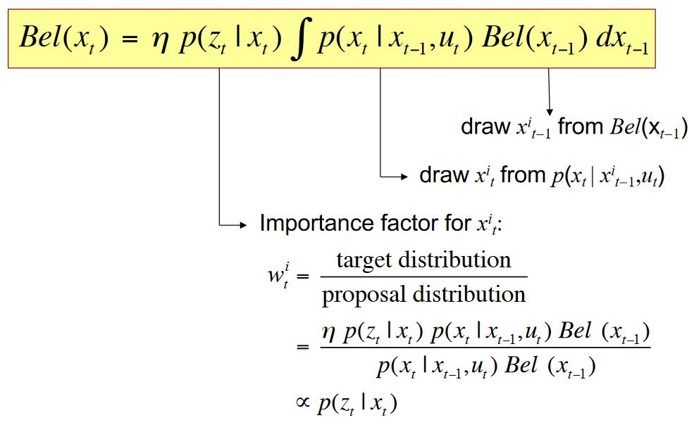
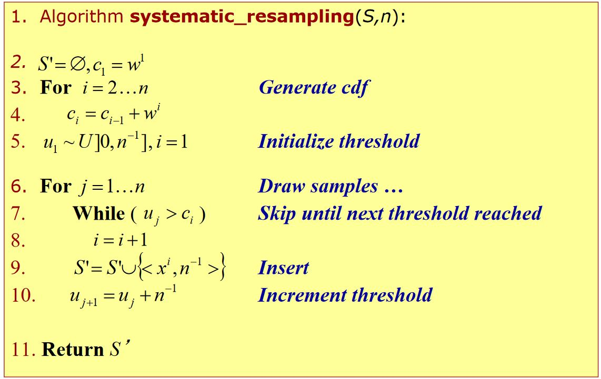

# ROS Monte Carlo Localization

Robust Monte Carlo Localization for Mobile Robots paper by Sebastian Thrun.
- http://robots.stanford.edu/papers/thrun.robust-mcl.pdf

Cyrill Stachniss - Particle Filter and Monte Carlo Localization 
 - https://www.google.com/url?sa=t&rct=j&q=&esrc=s&source=video&cd=&cad=rja&uact=8&ved=2ahUKEwia1qaV-cbuAhVmJzQIHe_RDiUQtwIwAXoECAEQAg&url=https%3A%2F%2Fwww.youtube.com%2Fwatch%3Fv%3DMsYlueVDLI0&usg=AOvVaw1ElJMZOoErRLEvtG_nEe1r 
## What's MCL?
- Estimating the state of a dynamical system is a fundamental problem
- The Recursive Bayes Filter is an effective approach to estimate the belief about the state of a dynamical system
   - How to represent this belief? & How to maximize it?§
 - Particle filters are a way to efficiently represent an arbitrary (non-Gaussian) distribution
 - Basic principle
   - Set of state hypotheses (“particles”) ->Survival-of-the-fittest
## Particle Filters

## Bayes Filtering

## MCL: The Algorithm

## MCL in Action

    4. Motion and Sensing
    5. Noise
    6. Particle Filter
    7. Importance Weight
    8. Resampling
    9. Resampling Wheel
    10. Error
    11. Graphing

    Mentor Help
    Ask a mentor on our Q&A platform
    Peer Chat
    Chat with peers and alumni

Introduction
