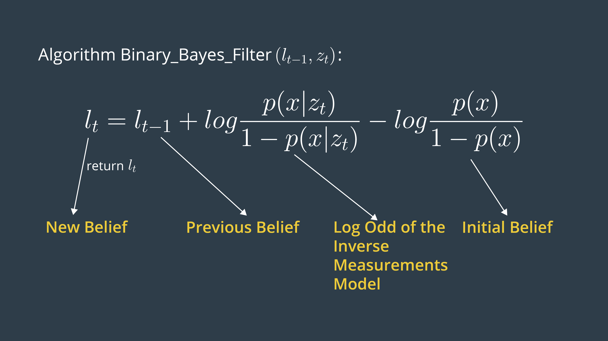

# Occupancy Grid Mapping Algo - UDACITY Robotics
- URL: https://www.udacity.com/course/robotics-software-engineer--nd209
- ROS Nano-degree class

# REFERENCES
- solid state Lidar chip: https://spectrum.ieee.org/tech-talk/semiconductors/design/kyber-photonics-solid-state-lidar-on-a-chip-system
- Occupancy Maps https://www.cs.cmu.edu/~16831-f14/notes/F14/16831_lecture06_agiri_dmcconac_kumarsha_nbhakta.pdf
- Learning Occupancy Grids Forward Models Sebastian Thrun  http://robots.stanford.edu/papers/thrun.iros01-occmap.pdf

# LOG ODDS
The advantage of using a log odds ratio representation is to avoid probability instabilities near 0 or 1. Another advantage relates to system speed, accuracy, and simplicity. Check out these two sources for more information on log probability and numerical stability:
- Log Probability https://en.wikipedia.org/wiki/Log_probability
- Numerical Stability https://en.wikipedia.org/wiki/Numerical_stability

# BINARY BAYES

#MEASUREMENT CONE
- mi​: Map at instant i or current cell that is being processed
- xi,yix_{i},y_{i}xi​,yi​: Center of mass of the current cell mi
- r: Range of the center of mass computed with respect to robot pose and center of mass
- k: The sonar rangefinder cone that best aligns with the cell being considered computed with respect to the robot pose (x,y,- θ\thetaθ), center of mass (xi,yi), and sensor angle.
- β\betaβ: Opening angle of the conical region formed out of the measurement beams.
- α\alphaα: Width of obstacles which is almost equal to the size of a cell. Please not that alpha is not the width of the - conical region as the video mention but instead it's the width of a cell. 

